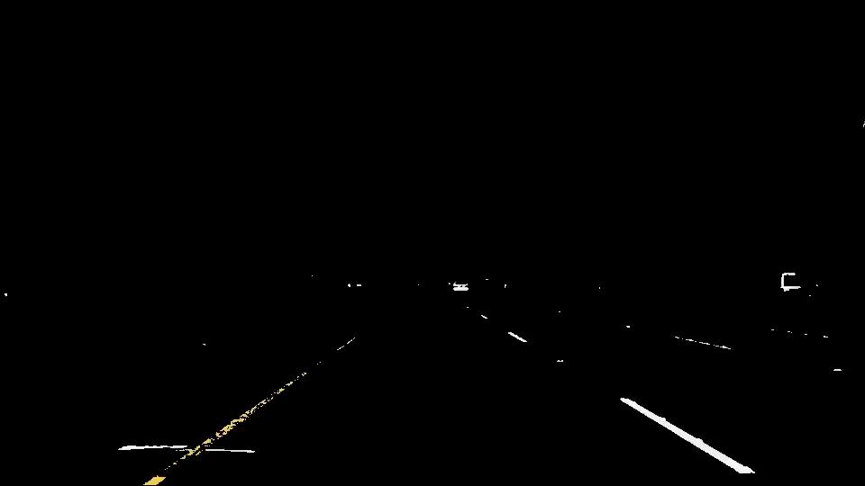
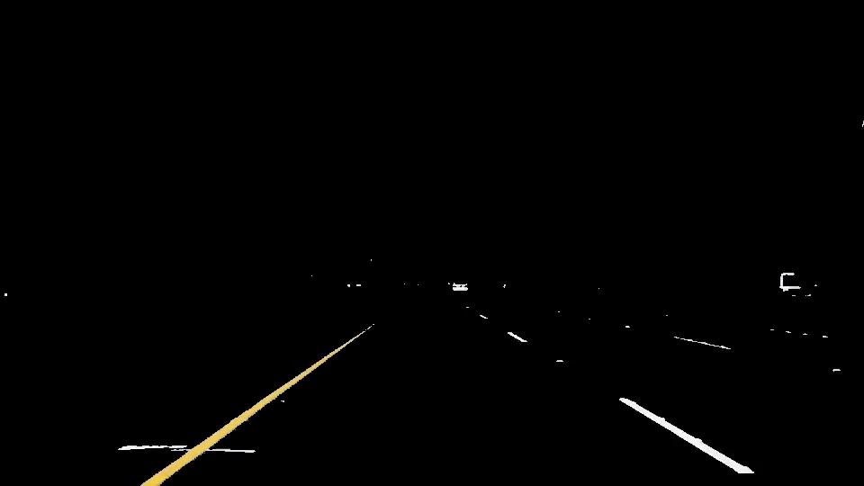
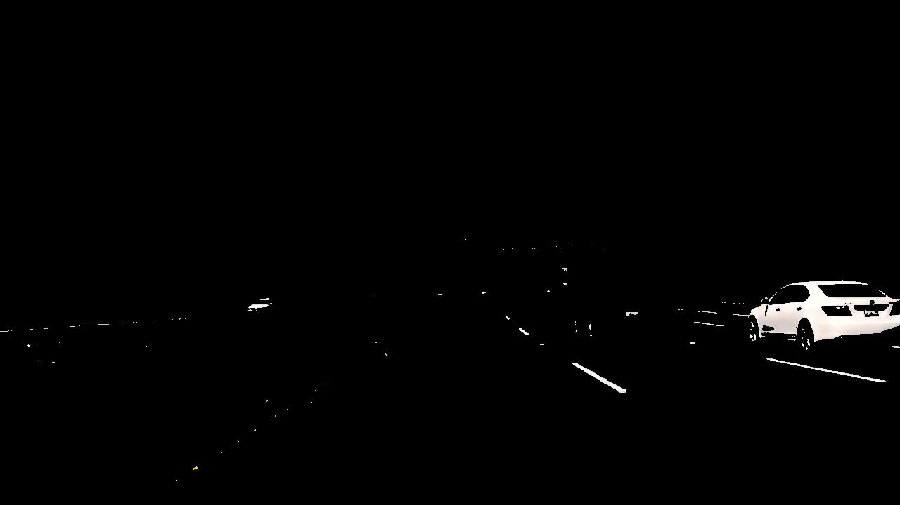
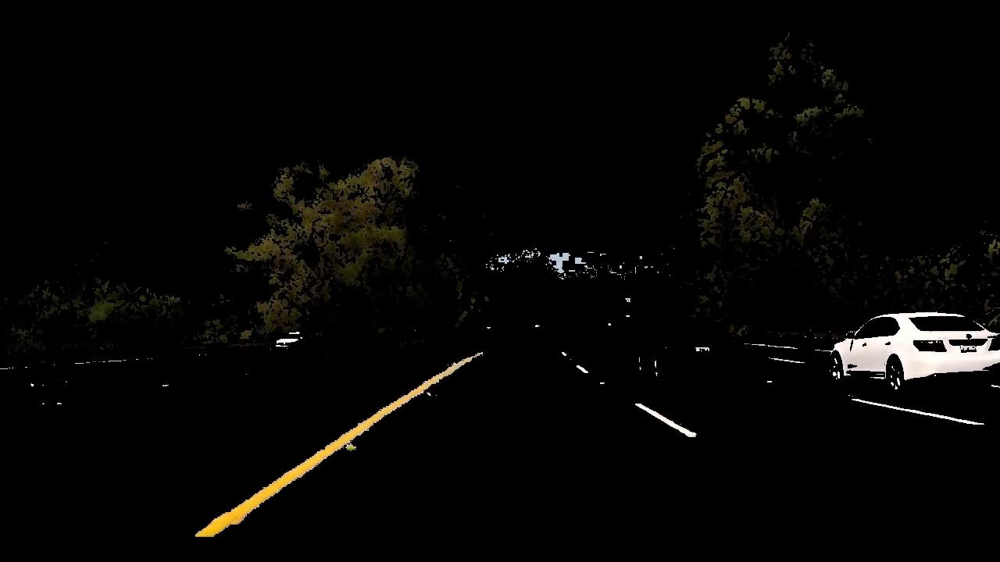
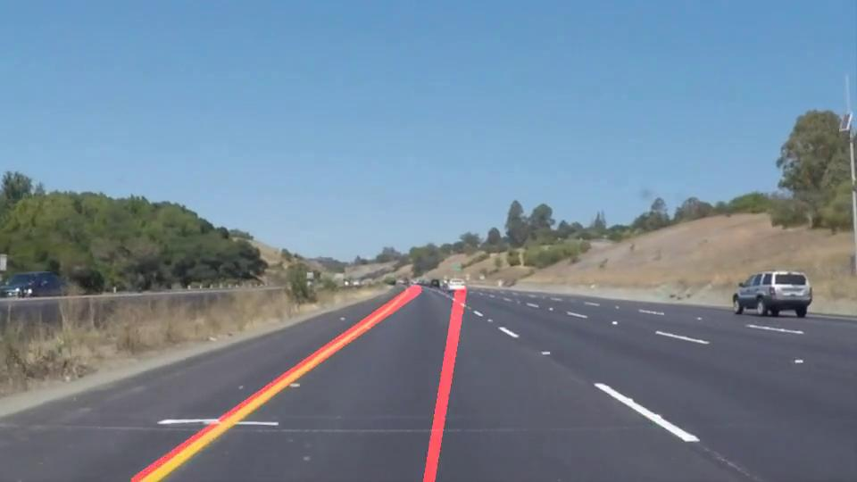
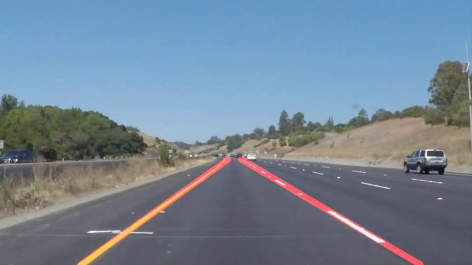
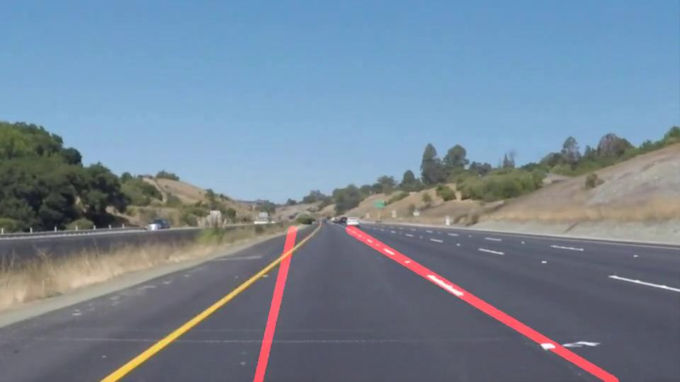
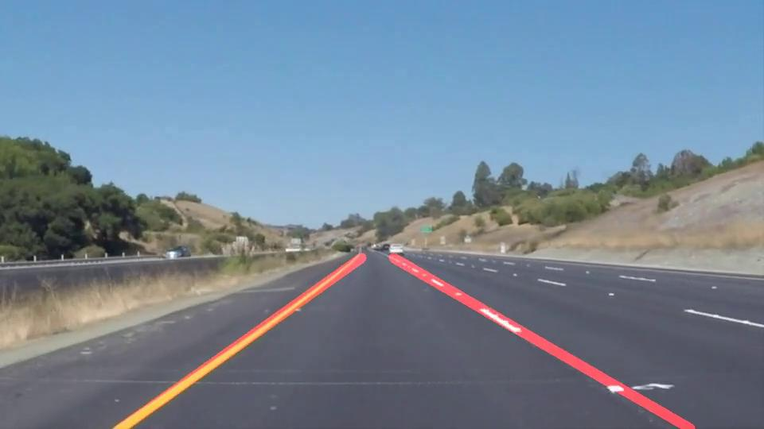

# **Finding Lane Lines on the Road** 
[](http://www.udacity.com/drive)


## 1. Overview
**Finding Lane Lines on the Road**

How does the algorithm recognize the lane lines?

First, we must understand how do human recognize the lane lines. There are many ways we can characterize the lane lines, however for most people we intutively recognize the lane lines by features like color, position and shape, just like how we learn to recognize any other objects or person.

To recognize the lane lines, we can apply the same techniques to teach the computer to do the same. Naturally we can treat the things we see with our eyes as a video stream or sets of moving images. And for computers to perceive the moving images like us, we need to undertand the information stored in the image and how can we extract useful features from it such as edge detection using Canny Edge detection algorithm, as well as finding lines from the detected edges using Hough transform algorithm.

## 2. Goal
The goal of this lane finding project is to track the lane lines on the road and draw the lines over the lane lines on the road. To do that, a series of computer vision pipelines (using openCV) is built to analyze the video stream.

## 3. Test Video Samples
Three test video samples are used to verify the lane detection pipeline.

1. [**Basic**]        : **Road with white lines only**

For the first case, the `solidYellowLeft.mp4` video contains the white lines only, it is considered as base case because to the white line features are easily identifiable on a dark color road pavement

2. [**Intermediate**] : **Road with white and yellow lines**

For the second case, the `solidWhiteRight.mp4` video contains both white and yellow lines are slightly more difficult for the pipeline to extract the lane line features (on a smooth dark road pavement)

3. [**Advanced**]     : **Light color pavement and mixed shades on the road**

Lastly, the third video `challenge.mp4` contains the most challenging case is the extras of the mixed of the shares on the road, the light color road pavement (that makes tracks yellow line filtering difficult), curve lines and shades on the road.

The test video outputs are stored in `test_videos_output` folder

## 4. Image and Color Space


### Image, Color Space (RGB, HSV, HLS) and Color Masks 

- Image data is made up number of pixels of different colors in 3 RGB color layers (Red,Green,Blue)
- Image file stores the color-pixel in stacks of arrays, each for different color channel.

### How do color space and color masks relate to finding lane lines and why they are important? 

Since images are stored in different color channels, it makes it easy to find the white and yellow lines or lanes if we can consider only the white and yellow pixels in the image. Here is a good example on using [OpenCV and Python for Color Detection](https://www.pyimagesearch.com/2014/08/04/opencv-python-color-detection/)

There are many different methods to filter/extract the colors from the image, images can be represented in a number of different color space such as RGB, HSV and HLS. 

More info can be found on [Color Space on Wiki](https://en.wikipedia.org/wiki/Color_space).

---


## 5. Lane Detection Pipeline


1. **Color Filtering** - `select_color_mask()` Select white and yellow color by using color masks (RGB/HSV/HLS). * **HLS** * color mask yields the most consistent color filtering in this project


2. **Grayscale** - `grayscale()`  Convert the image color to grayscale for Canny edge detection 


3. **Blurring** - `gaussian_blur()`  Blur the image using Gaussian blur transformation for smoother edge detection 


4. **Edge detection**  - `canny()`  Detect edges using Canny edge detection algorithm 


5. **Region of Interest**
    1. `select_polygon_vertices()`  Select the region of interest for the detected edges
    2. `select_masked_edges()`  Mask the detected edges with region of interest
 
6. **Hough Lines** `select_hough_lines()`  Apply Hough Lines transform to find lines using masked edges

7. **Paritioning the lines & Averaging and Extrapolating Lines**
    1. **Paritioning the lines** `partition_lines()`  Paritioning the lines to find left and right lanes
    2. **Averaging and Extrapolating lines** `avg_extrapolated_lines()`  Apply average and extra-polate algorithm (linear regression / polyfit) to find a straight line to track the lane line

8. **Process images in series** `process_video()` Apply all of the above image processing steps `process_image()` with a series of images using `moviepy.editor`

During the development of the pipeline, it is tested on a number of test images for verifications of the lane tracking performance under various conditions and parameters tuning. Once the output of the test images are satisified, the pipeline is followed by testing on a number of test videos to verify the lane line tracking in real-time.

Initially when the `draw_lines()` function was used, the lane line finding pipeline was only able to draw the line segments that were identified by Hough Transform (from the output of the Canny edges).

In order to improve the robustness of the lane line finding and able to mark the lanes clearly with a solid line, two additional stages are added to enhance the lane finding pipeline:

- Partitioning the left / right lane lines based on the line slope
- Approximation of a straight line that fits to each of the left / right lane lines

#### Choosing the Color Masks
<center>RGB vs HLS Mask Comparison #1: Yellow Lines video (t = 11.6s)</center>
<table>
    <tr>
        <td>  </td>
        <td>  </td>
    </tr>
    <tr>
        <td style="text-align: center; vertical-align: middle;" bgcolor="white"> RGB color mask is having difficulties retaining the yellow pixel </td>
        <td style="text-align: center; vertical-align: middle;" bgcolor="white"> HLS color mask robustly filter the yellow pixel </td>
    </tr>
</table>

**<center> <font color = 'green'> HSL color mask wins for consistent filtering yellow pixels </font> </center>**

In the video with yellow line, the HSL color mask performs better than the RGB because it is able to consistently filters smooth yellow pixels than RGB color mask, despite it sometimes picks up  unwanted noises such as yellow road sign and the lawn on the right. However, these minor imperfections of HLS mask should not be a problem, as later we can apply ```select_region_of_interest()``` to specifically crop the non-road sections.


**<center> RGB vs HLS Mask Comparison #2: Challenge video (t = 4.7s)</center>**
<table>
    <tr>
        <td>  </td>
        <td>  </td>
    </tr>
    <tr>
        <td style="text-align: center; vertical-align: middle;" bgcolor="white"> RGB color mask could not show lines </td>
        <td style="text-align: center; vertical-align: middle;" bgcolor="white"> HLS color mask shows lines </td>
    </tr>
</table>

**<center><font color = 'green'> HSL color mask wins because it robustly filters for the yellow line even under tree shades and light color pavement </font></center>**

In the challenge video with light color road pavement, the HSL color mask performs much better than the RGB because it is able to consistently filter smooth yellow pixels than RGB color mask even under a very low contrast with some part of the road with very
light color pavement. As mentioned earlier, th minor imperfections of HLS mask should not be a problem, as later we can apply ```select_region_of_interest()``` to specifically crop the non-road sections.

Bear in mind that color filtering is the important first step for this pipeline to work. Without robust approriate color filtering, the yellow lines will not be available as an input for the Canny edege detection and causes the lane detection pipeline to fail.

#### Partitioning the Lines that are not Horizontal

While partitioning the lane lines to left and right lanes by their graidents is useful to feed the line data to the straight line appoximation. It is a great opportunity to remove any unwanted lines which are not lane lines, for example *** rejecting *** any horizontal lines which have less than 15 degrees since the lane lines can never be horizontal lines (i.e. line gradient close to zero).

Below are the comparison of implementing the horizontal lines rejection by specifying 15 degrees angles to ignore the lines.


**<center> Horizontal Lines Rejection #1: Yellow Line Video (t = 11.52s)</center>**
<table>
    <tr>
        <td>  </td>
        <td>  </td>
    </tr>
    <tr>
        <td style="text-align: center; vertical-align: middle;" bgcolor="white"> Without rejecting the horizontal lines </td>
        <td style="text-align: center; vertical-align: middle;" bgcolor="white"> <b>With rejecting</b> the horizontal lines </td>
    </tr>
</table>

**<center> Horizontal Lines Rejection #2: Yellow Line Video (t = 14.76s)</center>**
<table>
    <tr>
        <td>  </td>
        <td>  </td>
    </tr>
    <tr>
        <td style="text-align: center; vertical-align: middle;" bgcolor="white"> Without rejecting the horizontal lines </td>
        <td style="text-align: center; vertical-align: middle;" bgcolor="white"> <b> With rejecting</b> the horizontal lines </td>
    </tr>
</table>

#### Averaging and Extrapolating the lines

After the lines have been partitioned by `partition_lines()`, we can create the best line of fit model to help us to map out the full extent of the lane lines by predicting the x coordinate of the lane line for a given y coordinate.

There are more than one way to implement the best line of fit for a straight line prediction. In this project, it is chosen to use two popular straight line model library:

- Scikit-learn `LinearRegression()` as linear regression:
    - `avg_extrapolated_lines_linear_reg()`


- Numpy's polyfit `np.polyfit()` as 1st order polynomial:
    - `avg_extrapolated_lines_polyfit()`

Both averaging and extrapolation methods were tested and work equally well. Scikit-learn `LinearRegresion()` is chosen as the preferred method to predict the line for the lane lines.

The lines are drawn from the bottom of the image and extend out to the top of the region of interest as the lane lines eventually emerge towards a single point.

#### Design of Region of Interest

Implementing the region of interest in a computer vision pipeline has two benefits:

- Improved accuracy by shortlisting important features for processing
- Improved pipeline efficiency by eliminating unwanted data to the next stage in the pipeline

Region of interest can be shape of any kind. In this project, a 4 sides polygon is chosen to encapsulate the left and right lane lines. The vertices of the polygon are chosen to shape like a trapezoid and the bottom base will be parallel to the bottom of the image like:

    #------------------------------------------------#
    #        Define vertices of the polygon mask     #
    #        to draw trapezoid shape                 #
    #                      -------                   #
    #                     /       \                  #
    #                    /         \                 #
    #                   /-----------\                #
    #------------------------------------------------#

The vertices coordinates of the polygon is calculated using `select_polygon_vertices()` with parameters to adjust `img_border_pct` - the image border offset of the ploygon as a percentage, and `height_pct` - the vertical offset from the top of the image as a percentage. 

These parameters are calibrated to work for all the test images and the test_videos (including the optional challenge).

### 6. Potential Shortcomings with the Pipeline

#### Pipeline Design Consideration

As with any programs or pipelines, there are often cases where exists potential shortcomings on the accuracy and performance of the functionalities. A well design pipeline should be **generic enough** to deal with new conditions ***but*** **specific enough** to target on intended operating conditions.

#### Robustness vs Stabilisation Tradeoff - Image Pre-processing Parameters Tuning

The performance and robustness of the lane lines finding pipeline to find the lines using Hough transform `cv2.HoughLinesP()` which are largely dependent on its input: the quality of the pre-processing image, this is based on selection of color filtering, blurring, edge detection, region of interest.

One potential shortcoming is the tradeoff of the level of preprocessing on the tracking performance to robustness of the overall pipeline. In order to ensure robustness of  finding lane lines works for every video, it is cruical to have consistent edge detection at every video, else there will be no edges to find lines and the pipeline will fail.

For example, aggressively pre-processing the image tend to filter out more unwanted noises on the image which makes the lane line tracking less jittery but at the same time also lessen the sensitivity of detecting edges. When an aggresive pre-processing setting is chosen, the chances of no edges detection increases and imposes risk of the pipeline failing.

Therefore, careful selection of parameters for color filtering, blurring, edge detection, region of interest are chosen on conservative values while maintaining reasonable lane finding stabilisation.

#### Lighting conditions

Another shortcoming is the light contrast or shade variations on the road (as seen in the `test_videos/Challenge.mp4` video), which makes the lane finding algorithm difficult to filter/distinguish the lane lines from the road.

The pipeline works with limited lighting conditions (i.e. day time) with high contrast, so that the white and yellow lines can filtered from the image. The pipeline is likely to struggle to work on low light conditions (i.e. at dusk or at night).

#### Camera / Lens Specific

The pipeline will work well under the assumption of running it with the same dash camera that was used to calibrate/tune used parameters in `process_image()` because **camera resolution and camera colors** varies amongst camera. Color filtering parameters may need to adjust according to adapt to specific camera application.

#### Camera Position and Orientation

**Camera orientation and the mounting location** also play an important factor in pipeline because it affects the selection of the region of interest (ROI), which is a great tool used to crop out the non-road sections from the image before the pipeline identifies the lines from the (ROI) masked detected edges. 

All the test images and videos are captured in landscape, so if the camera would have mounted in portrait, then the ROI mask needs to be rotated accordingly to compensate for the **Hough transform** and the **lines partitioning** to work

The camera mounting location also greatly affects the robustness of the lane finding pipeline because different locations may include unwanted objects such as the engine cover at the bottom of the video, as seen in the `Challenge.mp4` video. Therefore tuning of vertical offset for the ROI mask is required, unfortunately, there is no one fit for all solution for optimum vertical offset and need to calibrated manually.


#### Large Curvature Lanes

Currently the lane line finding pipeline assumes the lane lines in the video are straight line and will work well also for near-straight curve lines. However, it is anticpated that it will not working well if the curve is too large then the linear model will no longer work well, which means the linear regression mode will probably needs to be replaced with a 2nd or 3rd order polynominl fitting model to predict the lane lines on the curve.
    
#### Lane tracking Stability for Road bumps

The road bumps on the road may distrub the lane tracking temporarily, more algorithms need to add to the pipeline to filter the vertical/horizotal image drift or offset.

### 7. Parameter Values and Effects

In this pipeline, many parameters have been used to extract useful features during the pre-processing, edge detection and line detection. Some parameters are more sensitive than others for the edge/line feature extractions. Loosely speaking the parameters used in the earlier part of the pipeline tends to have more influence to the lane line tracking output.

Through experimentation of trying different parameters, it was found that these group of parameters have a primary impact in the lane line tracking performance:

1. **Color Mask Thresholds** : 
The lower and upper threshold affects on the sensivity in selecting the white and yellow colors. If the range between these two thresholds is too small, then this may require the Canny edge detection thresholds to be more sensitive, vice versa.


2. **Gaussian Kernel Size**: 
The kernal size is a number dicate the size of the Gassuian kernal array and this number must be an odd number. Kernel size of 3 and 5 are are commonly used. For this project, a relatively large kernel size of 15 is chosen to blur the image more to result in a fewer edges detection for background noise rejection reason.


3. **Canny Edge Detection Threshold** : 
John F. Canny, the inventor of the edge detection recommends the optimal ratio of the lower and upper thresholds ideally should be set around 1:2 or 1:3 for the edge detection to to work. In general, smaller values in the lower and upper thresholds tend to be less sensitive in recognizing the edges.

After setting the paramters in the HLS color mask thresholds and Gaussian kernel, Canny edge threshold ratio of 1:3 is chosen and then an optimal threshold values are identified after some trial and errors.

4. **Hough Lines Threshold** :

Apart from getting the edge detection right, the Hough line parameters also play an important role to convert the edges to line segments using the [`cv2.HoughLinesP()`](https://docs.opencv.org/2.4/modules/imgproc/doc/feature_detection.html?highlight=houghlinesp#houghlinesp)

    rho          : Distance resolution in pixels of the Hough grid
    theta        : Angular resolution in radians of the Hough grid
    threshold    : Minimum number of votes (intersections in Hough grid cell)
    min_line_len : Minimum number of pixels making up a line
    max_line_gap : Maximum allowed gap in pixels between connectable line segments


Smaller `rho`, `theta` and `threshold` values make more line segments to be recognized. These parameters were tuned to being able to just registering the lane line segments. To make tuning of these paramters easier, `rho` and `thea` are set to 1 and `threshold` were set from low values and gradually to increase until the line segments for the lane lines cannot be recognized.

The `min_line_len` parameter specifies the minimum length of the line to the output, essentially it rejects any line segments that are shorter than this minimum line length. For this project, it was calibrated to reject the random lines in the image, for example the thin horizontal lines appeared in the test video.

The `max_line_gap` parameter specifies the sensitivity of connecting the line segments together, higher value makes the line segments to easier to connect and form a single line. A large value is chosen in this project to ensure the line segments are connected and results fewer lines output, this helps to reduce the variations of the lines and jittering while finding the lanelines.

[Effect of the Canny edge detection and Houghline Transform parameters also discussed here](https://dsp.stackexchange.com/questions/10467/influence-of-image-size-to-edge-detection-in-opencv)

5. **Vertices of the polygon mask: border and height of the mask** :

The vertices of the polygon mask is calculated based on the user specified parameters of the inner border of the image and the ratio of the height of the mask to the image height. The selection of these parameters help to filter out unwanted edges to be included for the linear lane line model prediction.

6. **Line angles to ignore** :

The `ignore_angle_degrees` angles to ignore parameter is served as rejecting non lane lines recognized by the Canny edge detection and the Hough line transform. As seen in the `solidYellowLeft.mp4` video, at times there is a small horizontal white line marking showing in the test video. Without the implementation of ignoring the line angles greater than non-zero angle, then this horizontal line is unexpectedly added to the pool of data to estimate the line of fit. In turn causes the lane line marking momentarily predict the incorrect the lane line.


### 8.  Conclusions

The lane finding pipeline was able to successfully to track the white and yellow lane lines well with little to no jittering, as seen in all the videos in the `test_videos_output` folder.

The pipeline was primarily constructed based on a series of computer vision libraries, followed by line fitting model and video editing libraries.

Approriate selection of the color masks, canny edge detection and hough line transform parameters are important for filtering the image background and extracting the line segments correctly. Based on the the line segments, the line fitting model was used to find the best line of fit to find the lane lines.


### 9.  Future Work

The above pipeline demonstrated the concept of finding lanes using simple computer vision techniques operate in certain conditions. There are still areas in the pipeline that can be improved such as better lane tracking for curves, able to work in low/no light condition, lane line tracking stability and robustness in the field.

#### Polynomial Fit to the Curve

Instead of using the linear regression model to predict the lane lines, a possible improvement could be using a 2nd or 3rd polynomial fit for the Hough lines.

#### Adaptable Parameters for Different Light Conditions

Currently the pipeline works well with good lighting conditions, a possible improvment to make the pipeline more robustness to a more diverse operating condition could be adding to a stage to the pipeline to replace some fixed parameters used the color filtering parameters, the edge detection and houghline transform with variables.

#### Adjust the Region of Interests based on the Landscape or Portrait Mode

Currently the pipeline only works when the video is in landscape, a posssible improvement is to create a function to identify if the input is landscape or portrait by the height and width dimensions and adjust the region of interest mask vertices accordingly.

#### Deep Learning Approach to Optimize Parameters

Rather than manually choosing many parameters such as thresholds used in the color mask, canny edge and hough transform for limited set of test images and video samples, it will be more effective to train a deep neural networks to find these optimum parameters.
